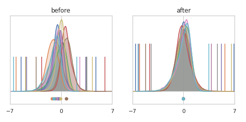

# Convolutional Neural Networks

**Learning and Building Convolutional Neural Networks using PyTorch.**

### Content

<details>
  <summary> Convolutional Neural Networks</summary>
      🔥 Basic ConvNet
      <br>
      🔥 AlexNet
      <br>
      🔥 VGGNet
      <br>
      🔥 NIN
      <br>
      🔥 GoogLeNet
      <br>
      🔥 BatchNorm + ConvNet
      <br>
      🔥 ResNet
      <br>
      🔥 DenseNet
      <br>
      🔥 Squeeze and Excitation Network
      <br>
      🚀 EfficientNet Network
      <br>
      🚀 MLPMixer Network
      <br>
</details>

### Create Environment
```python
python -m venv CNNs 
source CNNs/bin/activate 
```

### Installation
```python
pip install -r requirements.txt
```

### Run
```python
python main.py --model=resnet
```

**🔥 Basic ConvNet**

  - Simple Convolutional Network with BatchNorm.

**🔥 AlexNet**

  

  - AlexNet is widely remembered as the **breakthrough CNN architecture** on ImageNet dataset, but surprisingly its not the first CNN.

**🔥 VGGNet**

  

  - It brought in the idea of buliding **a block of network** like a template unlike previous CNN architecture where the network is built layer by layer with increasing complexity.

**🔥 NIN**

  

  - **Network In Network** introduced one of the key concept in deep neural network of **dimension downsampling/upsampling using 1x1Conv layer.**

**🔥 GoogLeNet**

  

  - It combined ideas from NIN and VGG network introducing InceptionV1 also known as GoogLeNet. 

**🔥 BatchNorm + ConvNet**

  

  - BatchNorm was introduced as a concept to **normalize the mini-batches traversing through the layer** and had an impactful results having **regularization** effect. But why BatchNorm is effective is quite unclear? the author suggests that BatchNorm reduce internal variant shift but other researchers  pointed out that the effects which batchNorm is effective against is not related to covariant shift. It is still widely discussed topic in DL.

**🔥 ResNet**

  

  - ResNet Architecture has huge influence in current DNN architectures. It introduces the idea of **skip connection**, a concept of **adding** an unfiltered input to the conv layers.

**🔥 DenseNet**

  

  - Building upon ResNet, DenseNet introduced the idea of **concatenating** the previous layers output and as well the inputs to the next layers.

**🔥 Squeeze And Excitation Network**

  

  - Squeeze and Excitation Network models the interdependencies of channels in the images.
