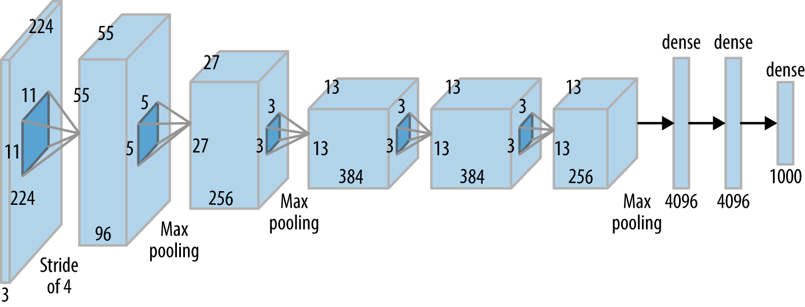
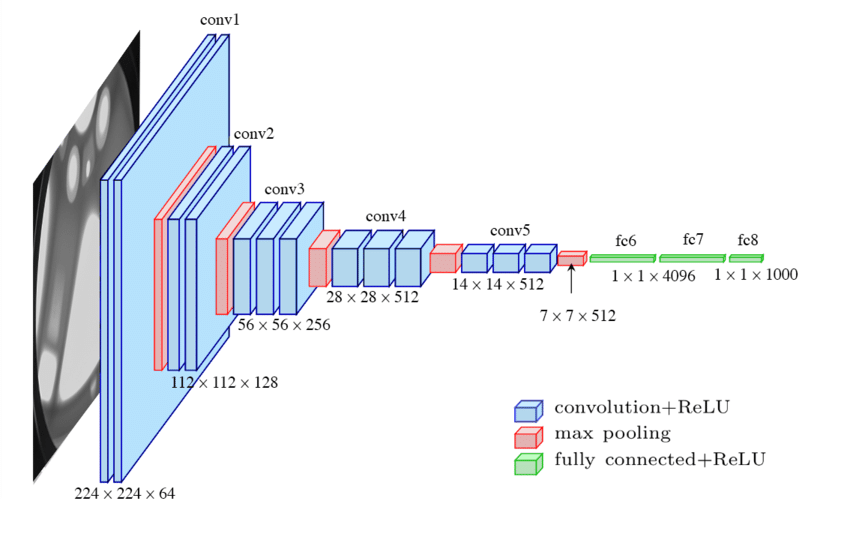
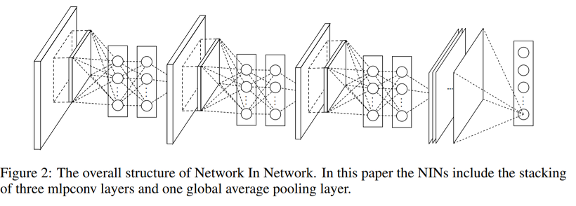
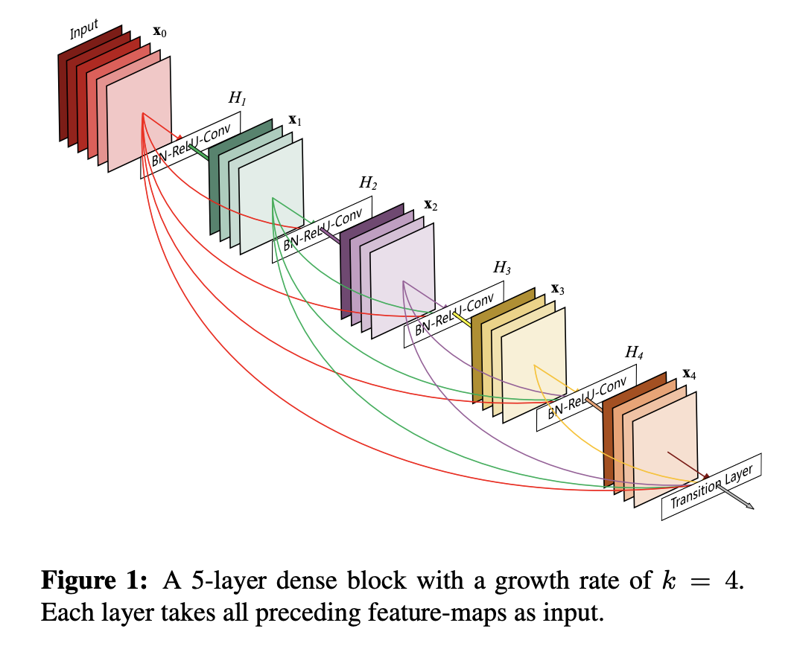
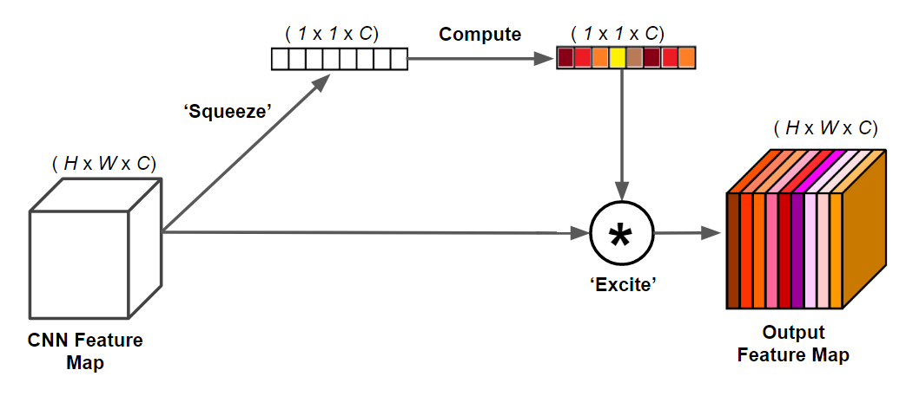

# Convolutional Neural Networks

**Learning and Building Convolutional Neural Networks using PyTorch.**

### Content

<details>
  <summary> Convolutional Neural Networks</summary>
      🔥 Basic ConvNet
      <br>
      🔥 AlexNet
      <br>
      🔥 VGGNet
      <br>
      🔥 NIN
      <br>
      🔥 GoogLeNet
      <br>
      🔥 BatchNorm + ConvNet
      <br>
      🔥 ResNet
      <br>
      🔥 DenseNet
      <br>
      🔥 Squeeze and Excitation Network
      <br>
      🚀 EfficientNet Network
      <br>
      🚀 MLPMixer Network
      <br>
</details>

### Create Environment
```python
python -m venv CNNs 
source CNNs/bin/activate 
```

### Installation
```python
pip install -r requirements.txt
```

### Run
```python
python main.py --model=resnet
```

**🔥 Basic ConvNet**

  - Simple Convolutional Network with BatchNorm.

<details>
  <summary>🔥 AlexNet</summary>
<p>
Before AlexNet, SIFT(scale-invariant feature transform), SURF or HOG were some of the hand tuned feature extractors for Computer Vision.

  In AlexNet, Interestingly in the lowest layers of the network, the model learned feature extractors that resembled some traditional filters.
Higher layers in the network might build upon these representations to represent larger structures, like eyes, noses, blades of grass, and so on.
Even higher layers might represent whole objects like people, airplanes, dogs, or frisbees. Ultimately, the final hidden state learns a compact
representation of the image that summarizes its contents such that data belonging to different categories can be easily separated.
Challenges perceived before AlexNet:

  Computational Power:

  Due to the limited memory in early GPUs, the original AlexNet used a dual data stream design, so that each of their two GPUs could be responsible
for storing and computing only its half of the model. Fortunately, GPU memory is comparatively abundant now, so we rarely need to break up models
across GPUs these days.

  Data Availability:

  ImageNet was released during this period by researchers under Fei-Fei Li with 1 million images, 1000 images per class with total of 1000 class.

  Note:
    Instead of using ImageNet, I am using MNIST and resizing the image to 224 x 224 dimension to make it justify with the AlexNet architecture.
</p>
</details>



<details>
  <summary>🔥 VGGNet</summary>
  
  <p>VGGNet brings in the idea of buliding **a block of network** like a template unlike previous CNN architecture 
    where the network is built layer by layer with increasing complexity.
  
  VGG network helps researchers think in terms of block of network. A typical network of convolution would 
require following steps
  
* Conv with padding for maintaining resolution.
* Activation Function
* Pooling for spatial downsampling
  
Note: I don't recommend running this until you have GPU, the number of parameters is increased by huge number compared
to AlexNet.
  
Changes made for faster convergence and which deviates from VGG Net is learning rate is changed to 0.05 and reduce the
number channels by 1/4th.
  
Check out the loss with these changes, since lr is high compared to typical values, the loss moves drastically and then
converges. Without Xavier's Weight Initialization, the model performs poorly.

Why VGG is slower than AlexNet?

  One reason is that AlexNet uses (11x11 with a stride of 4), while VGG uses very small receptive fields (3x3 with a
stride of 1) which makes it slower to move over the image and overall the parameters are 3 times the AlexNet.
This architecture is VGG-11.
  </p>
</details>
  


**🔥 NIN**

  

  - **Network In Network** introduced one of the key concept in deep neural network of **dimension downsampling/upsampling using 1x1Conv layer.**

**🔥 GoogLeNet**

  

  - It combined ideas from NIN and VGG network introducing InceptionV1 also known as GoogLeNet. 

**🔥 BatchNorm + ConvNet**

  

  - BatchNorm was introduced as a concept to **normalize the mini-batches traversing through the layer** and had an impactful results having **regularization** effect. But why BatchNorm is effective is quite unclear? the author suggests that BatchNorm reduce internal variant shift but other researchers  pointed out that the effects which batchNorm is effective against is not related to covariant shift. It is still widely discussed topic in DL.

**🔥 ResNet**

  

  - ResNet Architecture has huge influence in current DNN architectures. It introduces the idea of **skip connection**, a concept of **adding** an unfiltered input to the conv layers.

**🔥 DenseNet**

  

  - Building upon ResNet, DenseNet introduced the idea of **concatenating** the previous layers output and as well the inputs to the next layers.

<details>
<summary>🔥 Squeeze And Excitation Network</summary>
<p>
A typical convolution network has kernels running through image channels and combining
the feature maps generated per channel. For each channel, we'll have separate kernel which
learns the weights through backpropagation.
  
The idea is to understand the interdependencies between channels of the images by explicitly
modeling on it and hence to make the network sensitive to informative features which is further
exploited in the next set of transformation.

  * Squeeze(Global Information Embedding) operation converts feature maps into single value per channel.
  * Excitation(Adaptive Recalibration) operation converts this single value into per-channel weight.

  Squeeze turns (C x H x W) into (C x 1 x 1) using Global Average Pooling.
  
  Excitation turns (C x 1 x 1) into (C x H x W) channel weights using 2 FC layer with activation function
  inbetween, then which is expanded as same size as input.

  Rescale the output from excitation operation into feature maps as earlier.

  Based on the depth of the network, the role played by SE operation is differs. At early layers,
it excites shared low level representation irrespective of the classes. But in later stage, SE 
network responds differently based input class.
SE Block is simple and is added with existing CNN architecture to enhance the performance like 
ResNet or Inception V1 etc.

  Reference: https://amaarora.github.io/2020/07/24/SeNet.html
</p>
</details>


